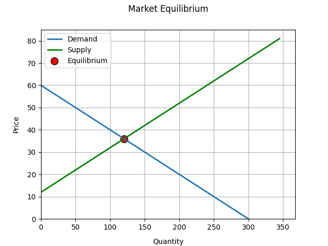

# Market Equilibrium Simulator

A Python program that simulates microeconomic market concepts, built by a
first-year BBusSci student at UCT to combine coursework from Economics
(ECO1110F) and Computer Science (CSC1015F).

## Features
- Calculates market equilibrium price and quantity
- Detects shortages and surpluses at any given price
- Simulates price ceilings and price floors
- Calculates Price Elasticity of Demand using the arc/midpoint method
- Interprets PED
- Visualises supply and demand curves using matplotlib

## Screenshot


## How to Run

Install matplotlib:
```
pip install matplotlib
```

Run the program:
```
python main.py
```

## Concepts Covered

**Economics (ECO1110F):**
- Supply and demand equilibrium
- Price controls — ceilings and floors
- Shortages and surpluses
- Price elasticity of demand

**Computer Science (CSC1015F):**
- Functions and modular program design
- Loops and conditionals
- Multi-file project structure
- List operations and f-strings

## Built With
- Python 3
- Matplotlib

